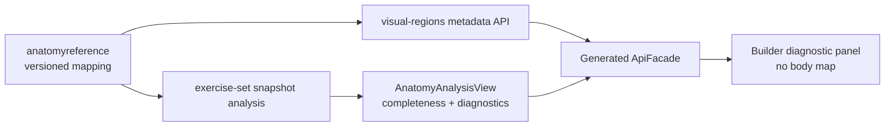

# ADR-017: versioned anatomy visual-mapping diagnostics

## Status

Accepted — 2026-07-30.

## Context

The anatomy-exposure result is a historical, versioned read model. A visual body map
needs editorial mapping from anatomical structures to visual regions, but a browser
dictionary would duplicate the authority, become stale and risk altering the meaning of
a published result.

## Decision

Visual-region metadata is owned by `anatomyreference` and exposed through
`GET /api/v1/anatomy/visual-regions`. Exercise-set anatomy analysis persists and returns
the versioned mapping completeness associated with its source snapshot. The Angular
builder consumes only generated OpenAPI models through `ApiFacade`.

SET-06A is diagnostic only: it exposes completeness and API-provided unmapped region
codes, layer and view where available. It deliberately does not draw a body map or carry
a frontend anatomy/region dictionary. A partial mapping keeps the tabular exposure
result available and uses the established Polish limitation message.

## Consequences

Published analysis remains interpretable after editorial mapping changes. The frontend
can make incompleteness visible without claiming to be a map renderer or clinical
authority. A future visual renderer requires a separate product and accessibility
decision; it must continue to use server-provided metadata and snapshots.

## Alternatives rejected

- A hard-coded frontend anatomy dictionary: duplicates and can drift from the owner.
- Rendering a map as part of this change: expands scope beyond diagnostics and requires
  dedicated accessibility, asset and interaction decisions.
- Recomputing a published result from current mappings: changes historical meaning.
