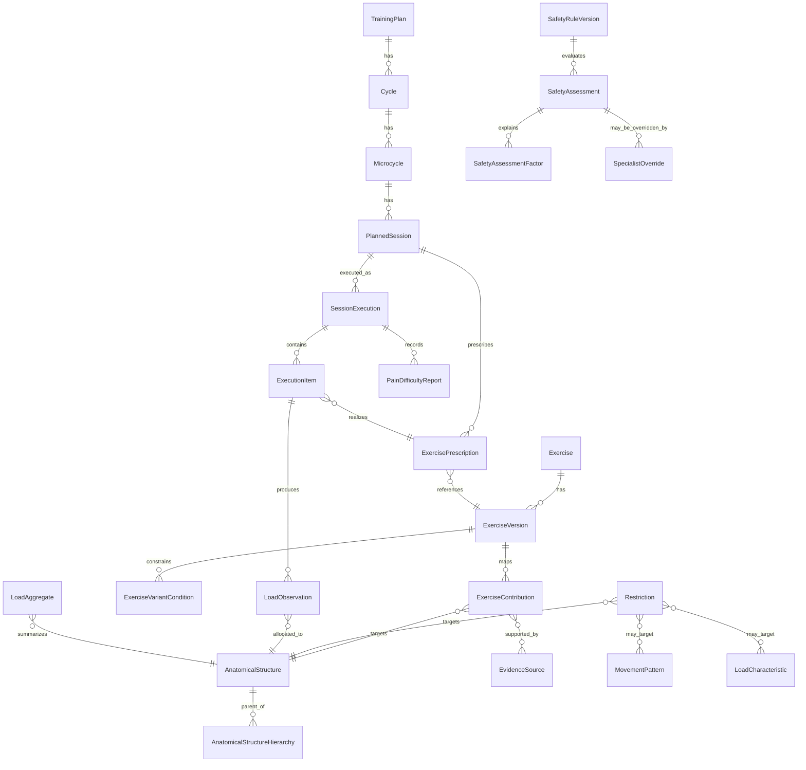

# Model obciążenia i anatomii dla moves

## Odpowiedź główna

Po przejrzeniu aktualnej specyfikacji `moves`, opisu technicznego i stanu repozytorium, najbezpieczniejszy i najbardziej uzasadniony naukowo kierunek dla pierwszej wersji **Training Planning Service** jest następujący: **nie budować jednego uniwersalnego skalara obciążenia**, tylko **wielowymiarowy profil obciążenia**, który rozdziela co najmniej: obciążenie zewnętrzne, odpowiedź wewnętrzną, ekspozycję anatomiczną według struktur, charakter obciążenia oraz niepewność. To jest zgodne zarówno z literaturą rozróżniającą obciążenie zewnętrzne i wewnętrzne, jak i z ograniczeniami modeli biomechanicznych oraz z niezmiennikami architektury `moves` dotyczącymi wersjonowania ćwiczeń, append-only execution i wersjonowanych reguł bezpieczeństwa. citeturn15search0turn15search3turn0search2turn1view0turn2view0turn24view0

Dla `moves` rekomenduję **model anatomiczny pośredni**, a nie prosty ani hiper-szczegółowy. Taki model powinien obejmować: regiony ciała, grupy mięśniowe, wybrane główne mięśnie, główne stawy i krótki katalog klinicznie istotnych grup ścięgnistych. Literatura biomechaniczna nie uzasadnia stabilnego przypisywania “procentów obciążenia” dla wszystkich mięśni, ścięgien i stawów w typowych ćwiczeniach konsumenckich, zwłaszcza między badaniami, technikami, ROM, tempem i populacjami. Dlatego w MVP lepsze są **role i pasma udziału** z zapisem pochodzenia danych oraz przedziału niepewności niż arbitralne liczby udające precyzję. citeturn7search4turn7search0turn7search1turn18search1turn18search9

W praktyce oznacza to, że `moves` powinno liczyć nie “ile użytkownik dostał jednego obciążenia”, ale raczej **jaki profil ekspozycji** otrzymały: np. staw kolanowy w płaszczyźnie strzałkowej, ścięgno Achillesa w kanale sprężysto-udarowym, mięśnie prostujące biodro w pracy koncentryczno-ekscentrycznej, oraz jaka była równocześnie odpowiedź subiektywna i ewentualnie fizjologiczna. To pozwala wspierać planowanie sportowe, profilaktyczne i terapeutyczne bez wchodzenia w automatyczną diagnostykę. citeturn15search3turn15search4turn17search1turn18search2turn1view0

Najważniejsze decyzje projektowe dla MVP są następujące:

| Pytanie | Rekomendacja | Status dowodowy |
|---|---|---|
| Jedna miara dla wszystkich form treningu? | **Nie.** Brak jednej naukowo uzasadnionej miary wspólnej dla siły, izometrii, plyometrii, mobilizacji, równowagi, treningu tlenowego i ćwiczeń terapeutycznych. | Silne dowody koncepcyjne i umiarkowane empiryczne. citeturn15search0turn15search3turn0search2turn15search1 |
| Skalar czy wektor? | **Wektor.** Minimum: `external dose`, `internal response`, `structure exposure`, `recovery context`, `uncertainty`. | Silne. citeturn15search0turn15search3turn6search18 |
| Poziom anatomii w MVP? | **Pośredni.** Regiony + grupy mięśniowe + wybrane mięśnie + stawy + wybrane grupy ścięgien. | Uzasadnienie pragmatyczne, zgodne z ograniczeniami metod. citeturn7search4turn7search1turn7search20 |
| Czy używać EMG jako procentu obciążenia mięśnia? | **Nie.** EMG mierzy aktywność elektryczną, nie bezpośrednio siłę ani “procent obciążenia” mięśnia. | Silne. citeturn7search4turn7search0turn3search7 |
| Czy ACWR ma być centralnym mechanizmem bezpieczeństwa? | **Nie.** Można ewentualnie liczyć pomocniczo w trybie badawczym, ale nie używać do blokad ani obietnic zapobiegania urazom. | Silne przeciw użyciu jako głównego predyktora. citeturn0search1turn0search4turn0search8 |
| ML w MVP? | **RULES_FIRST.** Tylko do QA katalogu, anomalii i antyfraud; nie do diagnozy, przewidywania urazu ani terapii. | Umiarkowane do silnych zastrzeżeń metodologicznych. citeturn23search3turn23search6turn23search15 |

Architektonicznie to dobrze pasuje do obecnego `moves`: specyfikacja wskazuje modularny monolit, wersjonowane definicje ćwiczeń, plan wskazujący konkretną wersję ćwiczenia, append-only wykonanie i korekty, bezpieczeństwo jako wersjonowane reguły oraz brak przekazywania danych medycznych do gamifikacji; techniczny overview doprecyzowuje osobne moduły `exercisecatalog`, `trainingplanning`, `trainingexecution` i `safety`, własne tabele modułów i PostgreSQL jako źródło prawdy. Repozytorium potwierdza, że dziś zaimplementowany jest głównie fundament, więc overengineering katalogu anatomicznego byłby przedwczesny. citeturn1view0turn2view0turn24view0

## Definicja obciążenia i ocena miar

W literaturze sportowej i rehabilitacyjnej najbardziej użyteczne rozdzielenie brzmi tak: **obciążenie zewnętrzne** opisuje wykonaną pracę lub ekspozycję treningową, **obciążenie wewnętrzne** opisuje psychobiologiczną odpowiedź organizmu na tę ekspozycję, a **obciążenie mechaniczne tkanek** dotyczy tego, jak dana ekspozycja przekłada się na mięśnie, ścięgna, stawy i inne tkanki. Te trzy poziomy nie są tożsame i nie powinny być mieszane w jednej liczbie. citeturn15search0turn15search3turn15search1turn18search2

Dla `moves` poniższe definicje są wystarczająco precyzyjne i implementowalne:

| Pojęcie | Minimalna definicja operacyjna w `moves` | Czy wolno sumować? | Uwagi |
|---|---|---|---|
| Obciążenie zewnętrzne | To, co użytkownik zrobił: czas, dystans, powtórzenia, serie, masa zewnętrzna, kontakty, tempo, ROM, przerwy. | Tak, ale tylko w zgodnych jednostkach/modułach. | Nie jest równe odpowiedzi biologicznej. citeturn15search0turn15search3 |
| Obciążenie wewnętrzne | Odpowiedź organizmu: sRPE, HR/TRIMP, ból, trudność, zmęczenie, wellness. | Tak, ale tylko w obrębie tej samej miary. | Nie wolno dodawać do obciążenia zewnętrznego. citeturn3search4turn3search16turn6search18 |
| Obciążenie mechaniczne mięśnia | Przybliżona ekspozycja mięśniowa w ćwiczeniu. | Tak, ale tylko w obrębie tej samej struktury i charakteru obciążenia. | W MVP jako jednostka ekspozycyjna, nie siła mięśniowa w niutonach. citeturn7search4turn7search1 |
| Obciążenie ścięgna | Przybliżona ekspozycja ścięgnista zależna od magnitudy, czasu i charakteru obciążenia. | Tak, struktura-po-strukturze. | Dla ścięgien znaczenie ma magnituda i historia ekspozycji. citeturn17search1turn17search7 |
| Obciążenie stawu | Zewnętrzne momenty lub przybliżona ekspozycja stawowa. | Tak, ale nie wolno utożsamiać momentu z siłą kontaktową. | W MVP używać kanałów jakościowych, nie próbować liczyć sił kontaktowych runtime. citeturn18search1turn18search9 |
| Objętość | “Ile” wykonano: serie, powtórzenia, czas, dystans, kontakty. | Tak, w spójnych jednostkach. | Sama objętość jest za mało informacyjna. citeturn15search6turn4search17 |
| Intensywność | “Jak ciężko”: %1RM, RIR/RPE, pace, power, HR zone, trudność. | Tak, w obrębie tej samej skali. | Nie unifikować arbitralnie między modalnościami. citeturn9search7turn9search2turn3search1 |
| Gęstość | Relacja pracy do przerw. | Tak opisowo. | Wpływa na odpowiedź wewnętrzną i lokalne zmęczenie. citeturn15search6turn4search17 |
| Zmęczenie ostre | Krótkoterminowe obniżenie gotowości po ekspozycji. | Nie jako jedna liczba globalna. | Lepiej modelować jako stan z wielu obserwacji. citeturn6search18turn6search1 |
| Obciążenie skumulowane | Suma lub wygładzenie ekspozycji w czasie. | Tak, ale dla konkretnego kanału. | Rolling / EWMA są opisowe, nie diagnostyczne. citeturn0search4turn6search22 |
| Tolerancja obciążenia | Aktualna zdolność przyjęcia dawki przez osobę/tkankę. | Nie. | To stan inferowany, nie prosta suma. citeturn17search14turn18search2 |
| Gotowość do treningu | Stan wejściowy przed sesją. | Nie. | Lepsza jako osobny zestaw wskaźników niż jeden score. citeturn6search1turn6search8turn6search18 |
| Odpowiedź biologiczna | Adaptacja lub maladaptacja po ekspozycji. | Nie. | Nie jest bezpośrednio obserwowalna w aplikacji konsumenckiej. citeturn17search1turn18search18 |
| Obciążenie deklarowane vs mierzone | Samoopis vs pomiar czujnikiem/labem. | Nie bez oznaczenia pochodzenia. | Wymaga osobnego pola `observation_mode`. citeturn15search9turn1view0 |

Najważniejszy wniosek praktyczny jest prosty: **nie istnieje jedna naukowo uzasadniona liczba, którą można sensownie sumować przez wszystkie typy treningu**. Można sumować wybrane miary wewnątrz ich własnej rodziny, na przykład `session-RPE load = czas × RPE` albo `TRIMP`, ale nie można uczciwie zsumować w jedną liczbę izometrii łydki, sprintów, głębokich przysiadów, ćwiczeń równoważnych i mobilizacji barku bez utraty znaczenia albo stworzenia pozornej precyzji. citeturn15search0turn15search3turn0search2turn15search6

Ocena praktycznych miar dla `moves`:

| Miara | Co mierzy | Populacje / walidacja | Atuty | Ograniczenia | Decyzja dla `moves` |
|---|---|---|---|---|---|
| `session-RPE` | Wewnętrzne obciążenie sesji | Dobrze wsparta w wielu sportach, u młodzieży i dorosłych; głównie populacje sportowe. citeturn3search4turn3search16turn3search20 | Tania, deklaratywna, sumowalna w czasie. | Gruba miara; słabo lokalizuje tkanki; podatna na timing i bias. | **Tak** jako podstawowy kanał internal load. |
| `TRIMP` i warianty | Obciążenie wewnętrzne oparte o HR i czas | Najsilniejsze zastosowanie w sportach wytrzymałościowych i zespołowych z monitoringiem HR. citeturn3search21turn3search1turn6search19 | Lepsze do treningu tlenowego niż sRPE w części zastosowań. | Wymaga urządzenia; słabe dla lokalnych obciążeń mięśniowo-ścięgnistych. | **Tak**, ale tylko jako opcjonalny kanał cardio. |
| `volume load` | `sets × reps × load` | Klasyczny RT. citeturn15search6turn21search14turn21search19 | Przydatny w podobnych ćwiczeniach oporowych. | Ignoruje ROM, tempo, stronę, dźwignie, bodyweight, lokalne tkanki; słaby poza RT. | **Tak**, ale tylko pomocniczo i lokalnie. |
| `%1RM` / `RM` | Relatywna intensywność RT | Dobrze osadzone w RT, słabiej w rehab i bodyweight. citeturn9search11turn9search7turn9search15 | Znane trenerom. | Zmienność osobnicza i dzienna; słabe dla wielu ćwiczeń klinicznych. | **Tak**, jako opcjonalny parametr RT. |
| `RIR/RPE` w serii | Bliskość do upadku, autoregulacja | Głównie zdrowi dorośli, często trenujący siłowo. citeturn9search2turn9search5turn9search20 | Dobre do autoregulacji bez testu 1RM. | Mniejsza pewność u początkujących i klinicznych. | **Tak** w RT i selected rehab strength. |
| `VBT` | Prędkość ruchu jako proxy intensywności/fatigue | Głównie zdrowi dorośli, ćwiczenia z mierzalną sztangą. citeturn9search4turn9search12turn9search19 | Bardziej obiektywne niż sam %1RM w wybranych liftach. | Sprzęt, nie obejmuje większości terapii, bodyweight i wielu maszyn. | **Nie w MVP**, **tak później opcjonalnie**. |
| `TUT` | Czas napięcia | RT i izometria. citeturn4search4turn4search12turn21search9 | Pomaga, gdy tonnage jest mylące. | Nie jest równoważne sile ani strainowi ścięgna. | **Tak** dla izometrii i wolnych temp. |
| Impuls / force-time | Mechaniczna dawka siła-czas | Głównie pomiar lab/sensor. citeturn18search18turn17search8 | Mechanicznie sensowny. | Wymaga instrumentacji; trudny runtime. | **Badawczo, nie MVP**. |
| “Hard sets” / “effective reps” | Hipoteza bodźca hipertroficznego | Głównie kulturystyka/RT. citeturn4search19turn9search13turn4search26 | Użyteczne do planowania hipertrofii. | To nie jest metryka bezpieczeństwa ani tkankowego loadu. | **Nie jako core metric**. |
| Monotony / strain | Zmienność tygodniowego loadu | Historycznie z sRPE. citeturn22search0turn22search3 | Dobre jako deskrypcja rozkładu obciążeń. | Słabe do lokowania ryzyka tkankowego. | **Tak**, tylko opisowo. |
| `ACWR` | Relacja krótkiego do dłuższego okna obciążeń | Szeroko używana, ale krytykowana metodologicznie. citeturn0search1turn0search4turn0search8 | Intuicyjnie prosta. | Poważne wady statystyczne i interpretacyjne. | **Nie** jako reguła bezpieczeństwa MVP. |
| Rolling averages / `EWMA` | Historia ekspozycji | Ogólne narzędzia analityczne. citeturn0search4turn6search22 | Lepsze niż pojedyncza sesja do trendów. | Nadal opisowe, nie predykcyjne same z siebie. | **Tak** do trendów i progów lokalnych. |

`Volume load` ma realną wartość głównie w klasycznym treningu oporowym i nawet tam jest zdradliwe, jeśli różnią się ROM, tempo, warianty, jednostronność czy dźwignie. Badania porównujące objętość opartą o liczbę powtórzeń lub tonnage z miarami uwzględniającymi ROM i TUT pokazują, że klasyczne liczenie może dawać myląco “równą” lub “nierówną” dawkę przy różnym rzeczywistym czasie napięcia i przemieszczeniu. Dlatego `moves` powinno traktować `volume load` jako metrykę lokalną dla podobnych ćwiczeń oporowych, a nie walutę uniwersalną. citeturn21search9turn21search14turn21search19turn21search2

Ćwiczenia jednostronne i asymetryczne trzeba modelować osobno dla strony lewej i prawej. Przeglądy dotyczące asymetrii pokazują związek z urazami co najwyżej umiarkowany i niejednoznaczny, zależny od sportu, testu i progu; nie ma jednej liczby asymetrii, która byłaby powszechnie operacyjna. W `moves` asymetria powinna więc być **deskrypcją rozkładu ekspozycji**, a nie samodzielną diagnozą ryzyka. citeturn16search2turn16search9turn16search21

Ćwiczenia bez ciężaru zewnętrznego nie są “bez obciążenia”. Dla nich podstawą powinny być inne prymitywy: masa ciała, pozycja dźwigni, czas napięcia, liczba kontaktów, tempo, ROM, jednostronność i ewentualnie subiektywny wysiłek. To jest szczególnie ważne dla plyometrii, izometrii, ćwiczeń stabilizacyjnych i części ćwiczeń terapeutycznych. citeturn18search2turn17search1turn4search12

`moves` powinno zawsze rozdzielać **dawkę zaplanowaną** od **dawki faktycznie wykonanej**. To nie jest detal techniczny, tylko warunek sensownej analizy adaptacji i bezpieczeństwa. Literatura pokazuje, że obciążenie planowane przez trenera i odczuwane / raportowane przez uczestnika nie jest tym samym konstruktem, a architektura `moves` już teraz zakłada jawne rozróżnienie planu, execution i deklaracji użytkownika. citeturn15search9turn1view0turn2view0

Brak danych i niepewność powinny być modelowane jawnie przez pola: `observation_mode`, `evidence_grade`, `confidence_class`, `value_low`, `value_high`, `source_id`. Bez tego system będzie mieszał pomiar laboratoryjny, estymację modelową i samoopis tak, jakby były równoważne. citeturn7search1turn7search4turn1view0

## Model anatomiczny i mapowanie ćwiczeń

Najlepszy kompromis dla `moves` to **minimalny model pośredni**. Model prosty jest zbyt ubogi do sensownego bezpieczeństwa tkankowego, a model szczegółowy z pojedynczymi głowami mięśni, wszystkimi ścięgnami i wektorami sił tworzy bardzo wysoki koszt redakcyjny przy słabej stabilności współczynników i dużym ryzyku pozornej precyzji. citeturn7search4turn7search1turn18search1

Porównanie wariantów:

| Wariant | Zawartość | Wartość kliniczna | Wartość treningowa | Koszt konfiguracji | Ryzyko pozornej precyzji | Rekomendacja |
|---|---|---:|---:|---:|---:|---|
| Prosty | Regiony + grupy mięśniowe | Niska–umiarkowana | Umiarkowana | Niski | Niskie | Za słaby dla safety engine. |
| Pośredni | Regiony, grupy mięśniowe, wybrane mięśnie, stawy, wybrane ścięgna, wzorce ruchowe | **Wysoka praktyczna** | **Wysoka praktyczna** | Umiarkowany | Umiarkowane | **Rekomendowany dla MVP**. |
| Szczegółowy | Pojedyncze mięśnie, głowy, wszystkie ścięgna, kierunki i komponenty sił | Potencjalnie wysoka w labie | Wysoka w badaniach | Bardzo wysoki | **Bardzo wysokie** | Nie dla MVP. |

Do jednego ćwiczenia w MVP rekomenduję średnio przypisywać **6–12 obiektów klinicznie/treningowo istotnych**, zwykle: 1–3 struktury `PRIMARY`, 2–4 `SECONDARY`, 0–2 `STABILIZER`, 1–3 stawy oraz 0–2 grupy ścięgniste. To nie jest twierdzenie z literatury, tylko **decyzja redakcyjna wynikająca z ograniczeń danych**: katalog ma być utrzymywalny, zrozumiały i możliwy do podwójnej recenzji. Przypisywanie wszystkich aktywnych mięśni w każdym ćwiczeniu jest mało wiarygodne i słabo użyteczne. citeturn7search4turn7search20turn7search1

Próg “istotnego udziału” powinien być definiowany pragmatycznie, nie jako domniemany procent siły mięśnia. Struktura trafia do modelu, jeśli spełnia co najmniej jeden warunek: jest głównym generatorem ruchu, stale i istotnie stabilizuje segment, jest klinicznie częstym celem ograniczeń albo ma dobrze udokumentowane znaczenie w danym wariancie ćwiczenia. To jest lepsze niż wpisywanie dziesiątek struktur na podstawie pojedynczych badań EMG. citeturn7search4turn3search7turn18search2

Reprezentacja udziału powinna mieć dwie warstwy: **roli** i **pasma ekspozycji**. Rola: `PRIMARY`, `SECONDARY`, `STABILIZER`. Pasmo: `LOW`, `MODERATE`, `HIGH`. Dopuszczalne jest także przechowanie przedziału liczbowego, ale tylko jako **przedział konfiguracji systemowej**, a nie jako rzekomy procent siły mięśnia lub procent obciążenia stawu. Współczynniki liczbowe są tu narzędziem agregacji, nie twierdzeniem anatomicznym. citeturn7search4turn7search0turn18search1

Mięśnie stabilizujące powinny być modelowane osobno, ale oszczędnie. Ich udział bywa realny funkcjonalnie, jednak literatura EMG i biomechaniczna nie daje stabilnej podstawy do przypisywania im precyzyjnych “udziałów procentowych” między różnymi osobami i technikami. Dlatego w `moves` stabilizatory powinny wpływać na profile bezpieczeństwa i balans wzorców, ale z mniejszą wagą domyślną niż mięśnie główne. citeturn16search4turn7search4turn7search12

W katalogu ścięgien nie warto iść szeroko. W MVP wystarczą **grupy ścięgien o wysokiej użyteczności klinicznej i dobrej literaturze obciążeniowej**, np. Achilles, patellar, quadriceps tendon, proximal hamstring tendon, adductor tendon, common extensor tendon łokcia, rotator cuff tendon group, long head biceps tendon group, gluteal tendon group. Włączenie więzadeł, chrząstki, powięzi i kości jako pełnych bytów katalogowych nie jest dziś proporcjonalne do danych dostępnych dla wersjonowanego katalogu ćwiczeń konsumenckich. Dla tych tkanek lepiej używać pośrednio `Joint` + `LoadCharacteristic` + `Region`. citeturn17search1turn17search14turn18search18turn18search2

Staw w modelu `moves` nie powinien być tylko pojedynczą etykietą. Lepiej reprezentować go jako `Joint` plus cechy ekspozycji: `plane`, `motion_pattern`, `load_characteristic` i opcjonalnie `range_band`. To wystarcza do tego, by reguła typu “ogranicz zgięcie kolana z wysoką kompresją” obejmowała właściwe ćwiczenia bez przypisywania zakazu do listy ćwiczeń. citeturn18search1turn18search9turn1view0

Metody mapowania ćwiczeń na anatomię różnią się radykalnie tym, co naprawdę mierzą:

| Metoda | Co mierzy | Czego nie mierzy | Użyteczność dla `moves` |
|---|---|---|---|
| sEMG / znormalizowane EMG | Aktywność elektryczną mięśni powierzchownych | Nie mierzy bezpośrednio siły, strainu ścięgna ani procentu obciążenia mięśnia. | Dobre do zasilania katalogu przez ekspertów; nie jako procent loadu. citeturn7search4turn7search0turn3search7 |
| Inverse dynamics | Zewnętrzne momenty stawowe | Nie daje sam z siebie sił kontaktowych ani indywidualnych sił mięśni. | Dobre do oznaczania stawów, płaszczyzn i kierunku ekspozycji. citeturn18search1turn18search9 |
| Modele mięśniowo-szkieletowe / OpenSim | Szacowane siły mięśni, kontaktowe, kinematyka/kinetyka | Wymagają założeń, kalibracji i walidacji; wyniki zależne od modelu. | Bardzo dobre do badawczej warstwy katalogu, nie do rutynowego runtime MVP. citeturn7search1turn30search9turn30search18 |
| Motion capture + force plates | Kinematyka i siły reakcji podłoża | Nie mierzą bezpośrednio sił mięśni bez modelu. | Dobre do walidacji wariantów i budowy referencji. citeturn7search2turn13search0 |
| Dynamometria | Zdolność generowania siły/momentu w teście | Nie mapuje bezpośrednio pełnego ćwiczenia. | Dobra do kalibracji intensywności i tolerancji, nie katalogu ćwiczeń per se. citeturn7search1 |
| US / odkształcenie ścięgna | Morfologię i część właściwości mechanicznych ścięgna | Nie daje taniego, uogólnialnego runtime dla konsumenta. | Tylko badawczo i do walidacji wybranych ścięgien. citeturn7search31turn17search8 |
| Klasyfikacja ekspercka | Syntezę danych z literatury i praktyki | Nie daje “prawdziwego” pomiaru. | **Najlepsza baza MVP**, jeśli jest podwójna recenzja i provenance. |

Najważniejsza odpowiedź metodologiczna brzmi: **amplituda EMG nie może być użyta bezpośrednio jako procent obciążenia mięśnia**. Relacja EMG–siła zależy od mięśnia, długości mięśnia, typu skurczu, prędkości, zmęczenia, crosstalk, normalizacji i zadania ruchowego. Porównywanie EMG między ćwiczeniami i badaniami wymaga dużej ostrożności; jest przydatne do klasyfikacji względnej i do wspierania oceny eksperckiej, ale nie do tworzenia tabel “mięsień = 63% obciążenia”. citeturn7search4turn7search0turn7search8turn3search7

Dlatego rekomendowany pipeline katalogowy jest mieszany: **literatura biomechaniczna + recenzja ekspercka + provenance + przedziały wartości**. Każde mapowanie `ExerciseVersion → AnatomicalStructure` powinno mieć własną wersję, własne źródła, klasę pewności i opcjonalnie warunki obowiązywania: sprzęt, chwyt, ustawienie, tempo, ROM, unilateralność, poziom użytkownika. citeturn7search1turn1view0

Ontologie anatomiczne są przydatne głównie jako `xref`, nie jako rdzeń runtime. **FMA** jest bardzo bogatą referencyjną ontologią anatomii człowieka, **Uberon** jest świetna do interoperacyjności międzygatunkowej i międzyontologicznej, a w obszarze aktywności fizycznej istnieją **PACO** i nowsze **EXMO**. Dla `moves` rozsądny kompromis to: własny prosty słownik domenowy + opcjonalne mapowanie `external_ontology_id` do FMA/Uberon dla anatomii i ewentualnie do EXMO/PACO dla interoperacyjności semantycznej. Pełne uruchamianie logiki biznesowej na dużej ontologii w MVP byłoby nadmiarem. citeturn8search0turn8search1turn25search1turn25search2turn8search2

## Bezpieczeństwo, progresja i cykle

Model bezpieczeństwa w `moves` powinien działać na **strukturach, wzorcach ruchu i charakterystykach obciążenia**, a nie na listach “zakazanych ćwiczeń”. To jest zgodne zarówno ze specyfikacją produktu, jak i z rzeczywistością kliniczną: ten sam wzorzec przysiadu może być właściwy, niewłaściwy albo warunkowo dopuszczalny zależnie od ROM, tempa, asymetrii, obciążenia, bólu, fazy rehabilitacji i konkretnej struktury docelowej. citeturn1view0turn2view0turn18search2

Rekomendowana typologia ograniczeń:

| Rodzaj ograniczenia | Autor | Skutek systemowy | Przykład |
|---|---|---|---|
| `PARTICIPANT_DECLARED` | uczestnik | zwykle `WARNING` lub `ALERT`, nie `HARD_BLOCK` bez potwierdzenia specjalisty | “ból barku przy ruchach nad głowę” |
| `SPECIALIST_RESTRICTION` | trener/fizjoterapeuta | może generować `HARD_BLOCK`, `WARNING` albo limit ekspozycji | “przez 14 dni bez głębokiego zgięcia kolana > moderate compression” |
| `SYSTEM_RULE` | wydawca reguł | co najwyżej `WARNING` lub `INFO`, chyba że reguła obsługuje aktywne ograniczenie specjalisty | “zbyt szybka progresja lokalnej ekspozycji” |
| `OBSERVATION_FLAG` | system lub specjalista | `ALERT` / obserwacja | “powtarzany ból > 6/10 po dwóch sesjach” |

W `moves` trzeba wyraźnie rozdzielić: **przeciwwskazanie**, **ostrożność**, **limit obciążenia** i **obserwację**. Proponuję cztery poziomy semantyczne: `CONTRAINDICATION`, `CAUTION`, `LIMIT`, `MONITOR`. Następnie dopiero warstwa wykonawcza tłumaczy to na `HARD_BLOCK`, `WARNING`, `ALERT`, `INFO`. Dzięki temu treść kliniczna nie miesza się z zachowaniem UI/workflow. citeturn1view0turn2view0

`HARD_BLOCK` powinien być zarezerwowany wąsko: dla aktywnego ograniczenia nadanego przez specjalistę, dla reguły prawno-operacyjnej albo dla sytuacji, gdzie plan narusza jawny, wersjonowany limit powiązany z takim ograniczeniem. Sam system nie powinien tworzyć twardej blokady dlatego, że “algorytm podejrzewa ryzyko urazu”. Literatura o load monitoring i injury prediction nie uzasadnia tak mocnego automatyzmu. citeturn0search4turn23search6turn1view0

`WARNING` jest właściwe, gdy system widzi sygnał ostrożności, ale nie ma podstaw do twardego zakazu: szybsza niż zwykle progresja lokalnej ekspozycji, nietypowa koncentracja obciążenia na jednej strukturze, niepełne dane o intensywności, konflikt z ograniczeniem deklaratywnym uczestnika albo okresowo podwyższony ból/trudność bez formalnego przeciwwskazania. `ALERT` jest właściwy po wykonaniu: zgłoszony ból, wysoka trudność, powtarzane niewykonanie, brak regeneracji albo odchylenie od planu wymagające triage specjalisty. citeturn1view0turn6search1turn6search18

Override musi być możliwy wyłącznie dla uprawnionego specjalisty i zawsze wymagać uzasadnienia, autora, czasu i zakresu. Uczestnik nie powinien sam usuwać aktywnego ograniczenia ustanowionego przez specjalistę; najwyżej może oznaczyć sprzeciw albo prośbę o rewizję. To jest spójne z architekturą audytu i wersjonowanych reguł już wpisanych w `moves`. citeturn1view0turn2view0

W obszarze progresji literatura nie daje jednej uniwersalnej bezpiecznej reguły. Popularna reguła “10%” jest słabym kandydatem na globalny mechanizm. W bieganiu starsze i nowsze badania nie potwierdzają prostego, uniwersalnego działania tygodniowego progu +10%, a nowsza analiza sugeruje, że znaczenie może mieć raczej skok **pojedynczej sesji** względem najdłuższej ostatnio wykonanej niż sama tygodniowa suma. Jednocześnie w treningu oporowym ACSM od dawna zaleca raczej lokalną progresję 2–10% po spełnieniu kryterium wydolności zadania, co jest innym konstruktem niż reguła biegowa. Tych reguł nie wolno mieszać między modalnościami. citeturn5search6turn5search3turn4search5

Dla ścięgien wniosek jest jeszcze bardziej modalny: adaptacja zależy silnie od obciążenia mechanicznego i ekspozycji w czasie, ale literatura wskazuje, że kluczowe znaczenie ma raczej magnituda obciążenia niż sam typ skurczu, a w tendinopatiach lepsze wyniki daje programowanie progresywne niż sztywne trzymanie się jednej formy, np. samych ekscentryków. To wspiera model `moves`, w którym dla wybranych struktur ścięgnistych przechowuje się lokalne limity, minimalne recovery windows i fazę progresji. citeturn17search1turn17search2turn17search6turn17search14

`Deload`, `taper` i `rehab reintroduction` powinny być modelowane jako **intencja fazy**, nie wynik prostego automatu. Proponuję `phase_intent = BUILD | MAINTAIN | RELOAD | DELOAD | TAPER | REINTRO`. Literatura fitness–fatigue jest przydatna jako model koncepcyjny planowania, ale jej wersje ilościowe są czułe na sposób kwantyfikacji loadu i nie dają stabilnego personalnego predyktora dla ogólnej populacji użytkowników aplikacji. citeturn6search0turn6search2turn6search10

Wykrywanie “braku równowagi” powinno unikać pojęcia `muscle balance` jako rzekomej naukowo zamkniętej normy. Literatura o asymetrii i imbalance jest mieszana; sensowniej jest mówić o: nadmiernej koncentracji ekspozycji na jednej strukturze, długotrwałym zaniedbaniu wzorca ruchowego, jednostronnej dominacji ekspozycji albo niespełnieniu zadanego celu planistycznego ustalonego przez specjalistę. citeturn16search2turn16search19turn16search9

System nie powinien komunikować, że “zapobiega urazom”. Może uczciwie mówić, że **wspiera kontrolę obciążenia, wykrywa wzorce ostrzegawcze, sygnalizuje brak danych i pomaga specjalistom podejmować decyzje**. To jest zgodne z siłą obecnych dowodów. citeturn0search4turn23search6turn1view0

## Rekomendowany model obliczeniowy

Najbezpieczniej jest przyjąć, że `moves` liczy **profil obciążenia**, a nie jedną sumę. Profil powinien mieć osobne kanały dla: `sRPE_AU`, `TRIMP_AU`, `dynamic_exposure_units`, `isometric_seconds`, `impact_contacts`, `endurance_minutes_zone`, `pain_peak`, `difficulty_peak`, oraz osobne projekcje dla struktur anatomicznych. citeturn15search3turn3search4turn3search21turn17search1

Formalnie, dla atomu wykonania `a` i struktury `k`, obliczamy tylko te składowe, które mają sens w danym kanale:

```text
B(a,c) = bazowa dawka w kanale c

dla dynamic resistance:
B = reps × intensity_band_factor × effort_band_factor × side_factor

dla isometric:
B = hold_seconds × effort_band_factor × side_factor

dla impact/plyometric:
B = contacts × impact_band_factor × side_factor

dla endurance:
B = minutes × zone_factor

dla mobility/control:
B = reps_or_seconds × challenge_band_factor
```

To nie są siły biologiczne ani niutony. To są **konfigurowalne jednostki ekspozycji** w obrębie kanału. Ich rola jest analogiczna do dobrze znanych jednostek obciążenia treningowego: są sumowalne tylko w swoim własnym wymiarze, a nie przez wszystkie modalności naraz. citeturn15search6turn15search3turn3search4

Mapowanie na anatomię:

```text
Contribution(k,e,v,variant) = [low, high], role, confidence, evidence_grade

StructureLoad(a,k,c) = B(a,c) × ContributionInterval(k,e,v,variant,c)

SetLoad(k,c)     = Σ StructureLoad(a,k,c)
ExerciseLoad     = Σ SetLoad
SessionLoad      = Σ ExerciseLoad
WindowLoad(w)    = Σ SessionLoad over rolling window
EWMA(w, λ)       = Σ SessionLoad × exp(-λ × days_since)
```

Sumować wolno **wyłącznie** składowe o tym samym `structure`, `load_channel` i `observation_family`. Nie wolno zsumować np. `TRIMP` ze `StructureLoad` dla ścięgna Achillesa, ani `impact_contacts` z `isometric_seconds`, ani zewnętrznego momentu stawowego z raportem bólu. citeturn18search1turn18search9turn15search3

Rekomendowane kanały i jednostki dla MVP:

| Kanał | Jednostka | Sumowalność | Zastosowanie |
|---|---|---|---|
| `SESSION_S_RPE` | AU = min × RPE | sesja, tydzień, mikrocykl | globalna odpowiedź wewnętrzna |
| `CARDIO_TRIMP` | AU | sesja, tydzień, mikrocykl | tylko gdy jest HR |
| `DYN_EXU` | Exposure Units | tylko w tym kanale | lokalna ekspozycja dynamiczna mięśni/stawów/ścięgien |
| `ISO_SEC` | sekundy lub EXU | tylko w tym kanale | izometria |
| `IMPACT_CONTACTS` | liczba kontaktów lub weighted contacts | tylko w tym kanale | plyometria / udar |
| `ENDURANCE_MIN_ZONE` | minuty strefowe | tylko w tym kanale | lokalna i globalna ekspozycja tlenowa |
| `PAIN_MAX`, `PAIN_POST24H` | skala raportowana | nie sumować jak load | safety / triage |
| `DIFFICULTY_MAX` | skala raportowana | nie sumować jak load | autoregulacja / compliance |

Dla pierwszej wersji polecam trzy warianty modelu:

| Wariant | Opis | Plusy | Minusy | Rekomendacja |
|---|---|---|---|---|
| `MVP` | Role + pasma udziału + sRPE + lokalne EXU + rolling sums/EWMA + pain/difficulty | Tani, ręcznie konfigurowalny, zgodny z architekturą | Nie daje sił biomechanicznych | **Tak** |
| `Extended` | MVP + `%1RM/RIR/VBT/TUT/HR/TRIMP` + bogatsze warunki wariantu | Lepsze RT i endurance | Większa złożoność wejścia | Tak po pilotażu |
| `Research` | OpenCap/OpenSim/lab data, estimated joint moments, musculoskeletal simulation | Największa wartość badawcza | Wysoki koszt, walidacja, sprzęt | Nie dla MVP |

Przykładowa sesja `MVP`:

- Goblet squat 3×8, bilateral, `intensity=MODERATE`, `effort=MODERATE`
- Single-leg calf raise 3×12/strona, `effort=HARD`
- Side plank 3×30 s/strona, `effort=MODERATE`
- Session-RPE po sesji: 6/10, czas 45 min

Przykładowe współczynniki konfiguracyjne, jawnie **pragmatyczne**:
- `MODERATE intensity = 1.0`, `HARD effort = 1.25`
- `MODERATE effort = 1.0`
- `PRIMARY=[0.67,1.00]`, `SECONDARY=[0.33,0.67]`, `STABILIZER=[0.10,0.33]`

Wtedy:

```text
Goblet squat B_dyn = 3 × 8 × 1.0 × 1.0 × 1.0 = 24 DYN_EXU
Calf raise B_dyn   = 6 × 12 × 1.0 × 1.25 × 1.0 = 90 DYN_EXU   (6 serii bo 3 × lewa + 3 × prawa)
Side plank B_iso   = 6 × 30 × 1.0 = 180 ISO_SEC
Session sRPE       = 45 × 6 = 270 AU
```

Jeżeli katalog dla `single-leg calf raise` ma `Achilles tendon = PRIMARY [0.67,1.00]`, to sesyjna ekspozycja Achillesa w tym ćwiczeniu wynosi orientacyjnie `60.3–90.0 DYN_EXU`. Jeżeli 7-dniowe okno dla Achillesa przed tą sesją wynosi `25–35 DYN_EXU`, to po sesji dostajemy `85.3–125.0`, a jeśli aktywny plan lub specjalista ustawił górny miękki limit tygodniowy np. `100`, system zwraca `WARNING`; jeśli istnieje aktywny `SPECIALIST_RESTRICTION` z limitem `80`, zwraca `HARD_BLOCK` przed przypisaniem lub `ALERT` po wykonaniu z override trail, zależnie od workflow. Ten przykład jest celowo prosty i pokazuje sposób propagacji, a nie fizjologię ścięgna w niutonach. citeturn17search1turn17search8turn1view0

Propagacja niepewności nie powinna używać jednej “magicznej” liczby pewności. W MVP wystarczą:
- zakres `[low, high]`,
- `confidence_class = LOW | MODERATE | HIGH`,
- `source_count`,
- `source_mix = EXPERT_ONLY | EXPERT_PLUS_BIOMECH | LAB_MEASURED`.  
Przy agregacji sumujemy osobno minima i maksima; przy konflikcie źródeł nie “uśredniamy w ciszy”, tylko pokazujemy szeroki przedział i niższą klasę pewności. citeturn7search1turn7search4

Pseudokod agregacji:

```text
for each executed_item in session:
    ex_def = loadExerciseVersion(executed_item.exercise_version_id)
    atoms  = decomposeToAtoms(executed_item)   // set, rep-group, interval, hold

    for atom in atoms:
        channels = deriveChannels(atom, executed_item.measurements, config)

        for channel in channels:
            base_interval = computeBaseInterval(atom, channel, config)

            for contribution in ex_def.contributions.match(atom.variant_conditions, channel):
                structure_interval = multiplyIntervals(base_interval, contribution.interval)
                appendLoadObservation(
                    participant_id,
                    session_execution_id,
                    structure_id = contribution.structure_id,
                    channel = channel,
                    low = structure_interval.low,
                    high = structure_interval.high,
                    confidence = min(atom.confidence, contribution.confidence),
                    source = mergeProvenance(atom, contribution)
                )

rebuildSessionProjection()
rebuildRollingWindows(7d, 14d, 28d)
runSafetyRules()
```

Pseudokod walidacji planu przed przypisaniem:

```text
inputs = planned_session + participant_restrictions + specialist_restrictions + active_rule_version

exposures = simulatePlannedLoad(planned_session)

violations = []
for rule in active_rules:
    result = rule.evaluate(exposures, restrictions, participant_state)
    if result.triggered:
        violations.add(result)

if any(result.level == HARD_BLOCK):
    rejectAssignmentWithAudit()
else if any(result.level == WARNING):
    requireSpecialistConfirmation()
else:
    allowAssignment()
```

## Datasety, ontologie i proces budowy katalogu

Najważniejszy wniosek z przeglądu datasetów jest negatywny, ale użyteczny: **nie ma jednego gotowego, otwartego i komercyjnie bezpiecznego zbioru, który łączyłby katalog ćwiczeń z mięśniami, stawami, ścięgnami, wariantami techniki, ograniczeniami bezpieczeństwa i dobrze zwalidowanym biomechanicznym ground truth**. Są dobre zbiory fragmentaryczne: rehabilitacyjne, motion-capture, locomotion, OpenSim, EMG dla wybranych zadań, ale nie ma gotowego “Exercise Catalog for safety-aware planning”. citeturn28search6turn28search1turn27search3turn29search0turn12search20

Najbardziej użyteczne zasoby, które rzeczywiście da się zweryfikować:

| Zbiór / model | Oficjalny dostęp | Publikacja | Populacja / n | Zakres ćwiczeń | Dane | Licencja / komercja / redistribucja | Przydatność dla `moves` |
|---|---|---|---|---|---|---|---|
| **UI-PRMD** | strona Univ. of Idaho / cytowany data descriptor citeturn19search0turn28search4 | Vakanski 2018, DOI `10.3390/data3010002`, PMID `29354641` citeturn28search6 | 10 zdrowych osób, 10 ruchów / ćwiczeń, po 10 powtórzeń citeturn31search9turn31search21 | proste ćwiczenia rehab | kinematyka Vicon + Kinect | PDDL 1.0; komercja **tak**; redistribucja **tak** citeturn19search0turn19search4 | Dobre do wzorców ruchu i QA techniki; słabe do anatomii i safety. |
| **KIMORE** | wolny dostęp; RGB na żądanie i EULA citeturn19search1turn19search13 | Capecci 2019, DOI `10.1109/TNSRE.2019.2923060`, PMID `31217121` citeturn28search1 | 78 osób: 44 zdrowe, 34 z dysfunkcjami ruchowymi citeturn31search8turn32search8 | 5 ćwiczeń rehab citeturn32search2turn32search6 | RGB-D, skeleton, clinical score | częściowo restrykcyjne; komercja **niepewna/ograniczona**; redistribucja **ograniczona** citeturn19search1turn19search13 | Dobre do oceny jakości wykonania i przyszłego ML; słabe do pełnego katalogu. |
| **MoVi** | oficjalna strona + Dataverse, research-only citeturn19search2turn19search22 | Ghorbani 2021, DOI `10.1371/journal.pone.0253157` citeturn13search9 | 90 aktorów: 60 kobiet, 30 mężczyzn citeturn12search5turn13search20 | 21 akcji codziennych i sportowych citeturn12search5turn13search20 | optical mocap, video, IMU | non-commercial research; komercja **nie**; redistribucja **ograniczona** citeturn19search2turn19search22 | Dobre do wzorców ruchu i przyszłego ML; nie daje gotowej anatomii. |
| **AMASS** | oficjalny portal + GitHub tools citeturn12search0turn27search14 | Mahmood 2019, open motion paper/preprint; 40 h, 344 osoby, 11 265 motions citeturn27search10 | 300+ osób | bardzo szeroki ruch ogólny | ujednolicony mocap/mesh | non-commercial scientific/artistic; komercja **nie**; redistribucja **ograniczona** citeturn12search20 | Świetne do research/ML, słabe do klinicznego katalogu ćwiczeń i licencyjnie nie do produktu komercyjnego. |
| **Camargo lower-limb biomechanics dataset** | Mendeley Data, 3 części citeturn29search1turn29search10 | Camargo 2021, DOI artykułu `10.1016/j.jbiomech.2021.110320`, datasety Mendeley DOI m.in. `10.17632/fcgm3chfff.2` citeturn20search11turn29search16 | 22 able-bodied adults citeturn20search8 | lokomocja: level, stairs, ramps, transitions | 3D biomechanics + wearable sensors | CC BY 4.0; komercja **tak**; redistribucja **tak** citeturn29search16 | Dobre do research nad niższą kończyną i walidacji kanałów stawowych. |
| **OpenSim Core Models / opensim-models** | oficjalne repozytoria i wiki OpenSim citeturn30search1turn30search14 | platforma OpenSim: Delp/Seth i kolejne publikacje; best practices Hicks 2015 PMID `25474098` citeturn30search9turn7search1 | nie dataset osób, lecz modele referencyjne | lokomocja i wybrane segmenty/układy | modele `.osim`, geometria, przykłady | wiele core models z licencją MIT; komercja zwykle **tak**, ale model-zależnie, trzeba weryfikować per model citeturn30search1 | Bardzo dobre do warstwy badawczej katalogu i walidacji wariantów. |

Ontologie:

| Ontologia | Zakres | Przydatność dla `moves` | Rekomendacja |
|---|---|---|---|
| **FMA** | bogata anatomia człowieka | Najlepsza jako referencja `xref` dla struktur anatomicznych. citeturn8search0 | **Tak, jako external reference** |
| **Uberon** | anatomia wielogatunkowa / integracyjna | Dobra interoperacyjność, ale zbyt szeroka na runtime MVP. citeturn8search1 | **Tak, opcjonalnie jako external reference** |
| **PACO** | ontologia aktywności fizycznej | Przydatna semantycznie, ale nie rozwiązuje katalogu biomechanicznego. citeturn25search1turn25search12 | **Opcjonalnie** |
| **EXMO** | exercise medicine ontology | Ciekawa dla przyszłej interoperacyjności i badań, ale za ciężka jak rdzeń MVP. citeturn25search2turn25search5 | **Opcjonalnie** |

Ponieważ gotowy dataset nie wystarcza, realny plan dla `moves` to **własny katalog redakcyjny**. Minimalny formularz ekspercki dla jednego ćwiczenia powinien zawierać: identyfikator wersji ćwiczenia, wariant i warunki, wzorce ruchowe, regiony, struktury `PRIMARY/SECONDARY/STABILIZER`, grupy ścięgien, stawy i płaszczyzny, charakter obciążenia, pasma ekspozycji, przeciwwskazania strukturalne, min. recovery hints, źródła i ocenę pewności. Taki formularz jest zgodny z tym, co literatura realnie pozwala utrzymać i audytować. citeturn7search1turn7search4turn1view0

Proces redakcyjny powinien wyglądać tak: pierwszy ekspert oznacza ćwiczenie, drugi niezależnie recenzuje, system liczy zgodność między ekspertami, rozbieżności trafiają do adjudication queue, po publikacji powstaje niezmienna `ExerciseVersion`, a każda istotna zmiana tworzy nową wersję. Dla zgody między ekspertami warto raportować `Cohen κ` dla kategorii i `ICC` lub weighted agreement dla pasm. To jest standardowy i obronny proces dla katalogu, który ma później zasilać reguły bezpieczeństwa. citeturn7search1turn1view0turn2view0

Szacunek operacyjny, nie wynik z literatury: jedna adnotacja ćwiczenia w modelu pośrednim to zwykle ok. 25–40 min pracy głównego eksperta, 10–20 min recenzji i 5–10 min redakcyjnego QA. Przy stawkach specjalistycznych daje to rząd wielkości **90–300 PLN za gotową wersję ćwiczenia**. To warto policzyć wcześnie, bo koszt utrzymania katalogu będzie ważniejszy niż koszt samego schematu bazy.

## Model danych, ML, walidacja i decyzje produktowe

Najważniejsze uproszczenie modelu danych brzmi: **nie tworzyć osobnych tabel domenowych dla każdego typu anatomii, jeśli to nie daje wartości biznesowej na starcie**. Najlepszy kompromis to jedna encja `AnatomicalStructure` z typem i hierarchią, oraz cienkie widoki/projekcje dla `Muscle`, `MuscleGroup`, `Tendon`, `Joint`, `BodyRegion`, jeśli interfejs wymaga rozróżnienia. To ogranicza overengineering, a nadal pozwala zrealizować reguły bezpieczeństwa i agregację po strukturach. citeturn1view0turn2view0turn24view0

Rekomendowane agregaty i granice modułów:
- `Exercise Catalog`: `Exercise`, `ExerciseVersion`, `ExerciseVariantRule`, `ContributionProfile`, `EvidenceSource`.
- `Training Planning`: `TrainingPlan`, `Cycle`, `Microcycle`, `PlannedSession`, `ExercisePrescription`.
- `Training Execution`: `SessionExecution`, `ExecutionItem`, `PainDifficultyReport`, `ExecutionCorrection`.
- `Safety`: `Restriction`, `SafetyRuleVersion`, `SafetyAssessment`, `SafetyAssessmentFactor`, `SpecialistOverride`.
- `Load Projection`: `LoadObservation`, `LoadAggregate`, `RecoverySnapshot`.  
To odpowiada granicom z dokumentów `moves`, gdzie planowanie, wykonanie i safety są osobnymi modułami, a baza jest źródłem prawdy. citeturn1view0turn2view0

Diagram ER w wersji koncepcyjnej:



Kluczowe encje i pola:

```sql
create table exercise (
  id uuid primary key,
  slug text not null unique,
  status text not null
);

create table exercise_version (
  id uuid primary key,
  exercise_id uuid not null references exercise(id),
  version_no int not null,
  published_at timestamptz not null,
  title text not null,
  movement_pattern text[] not null,
  unilateral boolean not null,
  immutable_checksum text not null,
  unique (exercise_id, version_no)
);

create table anatomical_structure (
  id uuid primary key,
  code text not null unique,
  type text not null, -- BODY_REGION, MUSCLE_GROUP, MUSCLE, TENDON_GROUP, JOINT
  side_policy text not null, -- NONE, LEFT_RIGHT
  display_name text not null,
  external_ontology text null,
  external_id text null
);

create table exercise_contribution (
  id uuid primary key,
  exercise_version_id uuid not null references exercise_version(id),
  structure_id uuid not null references anatomical_structure(id),
  role text not null, -- PRIMARY, SECONDARY, STABILIZER
  load_channel text not null, -- DYN_EXU, ISO_SEC, IMPACT_CONTACTS...
  contribution_low numeric(8,3) not null,
  contribution_high numeric(8,3) not null,
  confidence_class text not null, -- LOW, MODERATE, HIGH
  evidence_grade text not null, -- STRONG, MODERATE, WEAK, EXPERT_ONLY
  variant_condition_json jsonb not null default '{}'
);

create table restriction (
  id uuid primary key,
  participant_id uuid not null,
  source_type text not null, -- PARTICIPANT_DECLARED, SPECIALIST_RESTRICTION, SYSTEM_RULE
  severity text not null,    -- CONTRAINDICATION, CAUTION, LIMIT, MONITOR
  structure_id uuid null references anatomical_structure(id),
  movement_pattern text null,
  load_channel text null,
  limit_value numeric(10,3) null,
  valid_from timestamptz not null,
  valid_to timestamptz null,
  author_id uuid not null,
  locked_by_specialist boolean not null default false,
  rationale text not null
);

create table load_observation (
  id uuid primary key,
  participant_id uuid not null,
  session_execution_id uuid not null,
  execution_item_id uuid not null,
  structure_id uuid not null references anatomical_structure(id),
  load_channel text not null,
  value_low numeric(12,3) not null,
  value_high numeric(12,3) not null,
  observation_mode text not null, -- DECLARED, DEVICE, LAB, ESTIMATED
  confidence_class text not null,
  provenance_json jsonb not null
);
```

Przykładowy rekord ćwiczenia:

```json
{
  "exerciseId": "ex-squat-goblet",
  "version": 3,
  "title": "Goblet squat",
  "movementPatterns": ["SQUAT", "KNEE_DOMINANT", "BILATERAL_SUPPORT"],
  "defaultLoadChannels": ["DYN_EXU"],
  "contributions": [
    {
      "structure": "musclegroup-quadriceps",
      "role": "PRIMARY",
      "channel": "DYN_EXU",
      "interval": [0.67, 1.00],
      "confidence": "MODERATE",
      "evidenceGrade": "MODERATE"
    },
    {
      "structure": "joint-knee",
      "role": "PRIMARY",
      "channel": "DYN_EXU",
      "interval": [0.50, 0.90],
      "confidence": "MODERATE",
      "evidenceGrade": "MODERATE"
    },
    {
      "structure": "tendongroup-patellar",
      "role": "SECONDARY",
      "channel": "DYN_EXU",
      "interval": [0.33, 0.67],
      "confidence": "LOW",
      "evidenceGrade": "WEAK"
    }
  ]
}
```

Przykładowa recepta:

```json
{
  "plannedSessionId": "ps-2026-08-03-a",
  "exerciseVersionId": "exv-squat-goblet-v3",
  "sets": 3,
  "reps": 8,
  "tempo": "CONTROLLED",
  "intensityHint": "MODERATE",
  "effortTarget": { "type": "RIR", "value": 3 },
  "restSeconds": 90,
  "side": "BILATERAL",
  "notes": "full pain-free ROM if tolerated"
}
```

Przykładowy wynik obliczeń i safety assessment:

```json
{
  "sessionExecutionId": "se-1001",
  "sessionInternalLoad": {
    "sessionSRPE_AU": 270
  },
  "structureLoads": [
    {
      "structure": "tendongroup-achilles-left",
      "channel": "DYN_EXU",
      "low": 30.1,
      "high": 45.0,
      "confidence": "MODERATE"
    }
  ],
  "safetyAssessment": {
    "status": "WARNING",
    "factors": [
      {
        "code": "LOCAL_LOAD_SPIKE_7D",
        "structure": "tendongroup-achilles-left",
        "observedHigh": 108.2,
        "limit": 100.0,
        "evidence": "rule+catalog"
      }
    ]
  }
}
```

ML należy ocenić chłodno:

| Use case | Decyzja |
|---|---|
| Automatyczne mapowanie nowego ćwiczenia na struktury | `ML_LATER` |
| Sugestia wstępnych współczynników udziału dla redaktora | `ML_LATER` |
| Wykrywanie nietypowych deklaracji / nabijania punktów | `RULES_FIRST`, później ML jako warstwa pomocnicza |
| Wykrywanie anomalii obciążenia | `RULES_FIRST`, potem `ML_LATER` |
| Personalizacja progów | `ML_LATER`, tylko po pilotażu i z pełną kalibracją |
| Przewidywanie niewykonania sesji | `ML_LATER` |
| Ocena jakości danych wejściowych | `RULES_FIRST` |
| Rekomendowanie zamiany ćwiczenia | `RULES_FIRST`, heurystyki katalogowe |
| Analiza sygnałów z urządzeń | `ML_LATER` |
| Diagnoza, przewidywanie urazu, automatyczna terapia | `DO_NOT_USE_ML` |

Ta ostrożność jest uzasadniona: przeglądy nad modelami ML dla przewidywania urazu w sporcie pokazują obiecujące wyniki eksperymentalne, ale też wysoki risk of bias, problemy walidacyjne i brak podstaw do wdrażania takich modeli jako praktycznych narzędzi klinicznych lub produktowych bez dużo lepszych danych i walidacji prospektywnej. citeturn23search3turn23search6turn23search15

Minimalny telemetry set, który warto zacząć zbierać już w MVP:
- planowana dawka,
- wykonana dawka,
- session-RPE,
- local pain/difficulty post-session i 24h,
- side,
- duration,
- skipped/modified/executed,
- observation mode,
- device presence flag.  
To są dane małe, celowe i wystarczające, by nie zamknąć drogi do późniejszych modeli jakości danych, compliance i anomalii, bez wchodzenia od razu w pełne dane medyczne.

Plan walidacji powinien mieć cztery warstwy. Po pierwsze, **content validity** przez panel trener–fizjoterapeuta–biomechanik. Po drugie, **inter-rater agreement** dla mapowań anatomicznych i reguł. Po trzecie, **retrospective simulation** na historycznych planach i wykonaniach pod kątem false positives, false blocks i missed warnings. Po czwarte, **prospective pilot** z wersjonowaniem katalogu i reguł. Metryki nie mogą ograniczać się do accuracy; potrzebne są: czułość dla wykrycia niebezpiecznych wzorców, swoistość dla ograniczenia fałszywych blokad, PPV/NPV dla alertów, calibration-in-the-large dla progów, coverage of uncertainty intervals oraz czas do rozstrzygnięcia alertu. citeturn7search1turn23search6turn1view0

Decyzje, których literatura sama nie rozstrzygnie, a produkt musi podjąć jawnie, są następujące. Trzeba wybrać docelowe populacje MVP: ogólna aktywność dorosłych, trening siłowy, powrót do sprawności, czy miks. Trzeba zdecydować, kto publikuje ćwiczenia i reguły bezpieczeństwa, jaki poziom fałszywych ostrzeżeń jest akceptowalny, kiedy specjalista może robić override, jak głęboko wchodzicie w dane zdrowotne, jak komunikować niepewność użytkownikowi i czy MVP obejmuje tylko ćwiczenia lądowe bez skomplikowanych urządzeń. To są decyzje produktowo-regulacyjne, nie pytania “do literatury”. citeturn1view0turn2view0turn23search6

Końcowa rekomendacja dla pierwszej wersji `moves` jest jednoznaczna: **wersjonowany katalog ćwiczeń z modelem anatomicznym pośrednim, wielowymiarowym profilem obciążenia, jawną niepewnością, safety engine opartym na strukturach i charakterystykach obciążenia, rolling/EWMA zamiast ACWR jako rdzenia, oraz architekturą rules-first bez ML do diagnozy czy przewidywania urazów**. Taki system będzie prostszy, uczciwszy naukowo i znacznie łatwiejszy do utrzymania niż pozornie “inteligentny” model udający biomechaniczną precyzję, której literatura dziś nie daje dla produktu tej klasy. citeturn15search0turn0search1turn7search4turn7search1turn1view0turn2view0