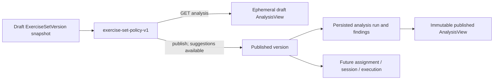

# Sugestie do zestawu Exercise Set (SET-05A)

**Status: wdrożone w backendzie.** Ten dokument opisuje faktyczny, ograniczony zakres
doradczego sprawdzenia SET-05A. Jest uzupełnieniem [modelu zestawów](exercise-set-model.md), a decyzję o
niezmiennym snapshocie publikacji utrwala [ADR-015](../adr/ADR-015-deterministic-versioned-exercise-set-analysis.md).

## Cel i granice

Analizator przekazuje specjaliście neutralne sugestie dotyczące metadanych, kolejności,
przybliżonego czasu oraz zmian sprzętu. Jest czystą polityką działającą wyłącznie na
snapshocie `ExerciseSetVersion`; nie odczytuje żywego katalogu, nie używa ML i nie
wydaje oceny klinicznej, bezpieczeństwa osoby ani gotowości dnia.

Analiza zestawu ma charakter wyłącznie doradczy. Ostateczna decyzja dotycząca zawartości zestawu należy do specjalisty.

`ExerciseSet` i jego wersja pozostają definicją wielokrotnego użytku. Assignment, plan,
termin i wykonanie nie są ani wejściem, ani wynikiem analizy.

## Wejście i wynik

Wejściem są metadane wersji (`title`, `profile`), uporządkowane pozycje, fazy, dokładne
`exerciseVersionId`, snapshoty nazw/wzorców ruchu/wymaganego sprzętu oraz typowane dawki.
Wynikiem `AnalysisView` są:

- publiczny `status`: `NO_SUGGESTIONS`, `SUGGESTIONS_AVAILABLE` albo
  `ANALYSIS_UNAVAILABLE`;
- metryki: liczba pozycji, szacowany czas, pewność czasu, liczba zmian sprzętu i rodzaju
  dawki oraz flaga dostępności danych anatomicznych;
- uporządkowane findings z kodem, severity, kategorią, kluczem komunikatu, wyjaśnieniem,
  pozycjami, fazą/polem i sugerowaną akcją.

Wszystkie findings, niezależnie od ich historycznej severity, są sugestiami do przeglądu;
nie oceniają poprawności decyzji specjalisty. Kategorie wewnętrzne to `STRUCTURE`,
`TIME`, `EQUIPMENT`, `DUPLICATE` i `DATA_LIMITATION`.

## Polityka, profile i czas

Polityka `exercise-set-policy-v1` może sygnalizować brak tytułu, profilu lub pozycji,
nietypową kolejność faz i niepełne dane dawki. Dla `FULL_SELF_GUIDED`,
`WARMUP_MODULE` i `MAIN_MODULE` oczekiwane fazy są wskazówką do przeglądu, a nie
warunkiem publikacji. Pozostałe profile (`HOME`, `THERAPEUTIC`, `MOBILITY`,
`STRETCHING`, `BREATHING`) nie mają w tej wersji dodatkowej reguły fazowej.

Analizator ostrzega o powtórzonej dokładnej wersji ćwiczenia i o sąsiadujących duplikatach.
Więcej niż dwie zmiany `requiredEquipment` daje ostrzeżenie, a więcej niż dwie zmiany
rodzaju dawki — sugestię. Czas jest deterministycznym przybliżeniem z dawki: strength
używa serii, powtórzeń i odpoczynku, izometria serii/hold/rest, a pozostałe rodzaje ich
czasów, powtórzeń lub cykli. Brak danych dla pozycji daje `TIME_ESTIMATE_PARTIAL`; wynik
ma `COMPLETE`, `PARTIAL` lub (dla pustego zestawu) `UNAVAILABLE`.

## Wersjonowanie, publikacja i utrwalenie

`GET /api/v1/specialist/exercise-sets/{setId}/versions/{versionId}/analysis` analizuje
draft na żądanie. Dla wersji opublikowanej zwraca utrwalony wynik, nie wykonuje ponownej
analizy. Publikacja wykonuje analizę na bieżącym snapshocie, ale findings nie wpływają
na jej wynik. Twarde odrzucenie publikacji dotyczy wyłącznie błędów technicznych, takich
jak brak uprawnień, nieistniejąca wersja ćwiczenia, konflikt optimistic locking,
niespójny request lub zmiana opublikowanej wersji.

Publikacja zapisuje pojedynczy `exercise_set_analysis_run` dla wersji wraz z findings w
`exercise_set_analysis_finding`; zapis obejmuje wewnętrznie politykę, lock version,
czas analizy, status, metryki i evidence findings. Dane te pozostają audytowe i nie są
usuwane. Historyczny wynik `BLOCKED` jest przy odczycie przedstawiany jako
`SUGGESTIONS_AVAILABLE`, bez wpływu na możliwość publikacji. Wersja opublikowana jest
więc wyjaśnialna i odtwarzalna mimo późniejszych zmian katalogu lub reguł.

## Wyjaśnialność i ograniczenia

Każdy finding zawiera wewnętrznie stabilny kod i wersję reguły, severity/kategorię,
zakres pozycji oraz uzasadnienie i akcję (`fix-draft` lub `review`). Interfejs przekłada
go na krótką, neutralną sugestię i nie eksponuje danych technicznych. Wynik nie jest
zaleceniem medycznym ani biomechanicznym modelem obciążenia.

Snapshot pozycji nie zawiera obecnie body position, difficulty ani klasyfikacji/anatomii.
Dlatego `anatomyDataAvailable` zawsze ma wartość `false`, a analiza zawsze zwraca
`ANATOMY_DATA_UNAVAILABLE`; nie ocenia anatomii ani pozycji ciała. Brak ten ma być jawny,
nie zastępowany heurystyką lub odczytem żywych danych katalogowych.

SET-06 może dodać profilowe reguły kompletności i jakościowe dane anatomii dopiero z
wersjonowanym snapshotem oraz jawną informacją o kompletności danych. SET-07 pozostaje
osobnym zakresem: materializowane warianty short/minimum i zatwierdzanie propozycji;
SET-05 nie generuje ani nie zatwierdza wariantów.
