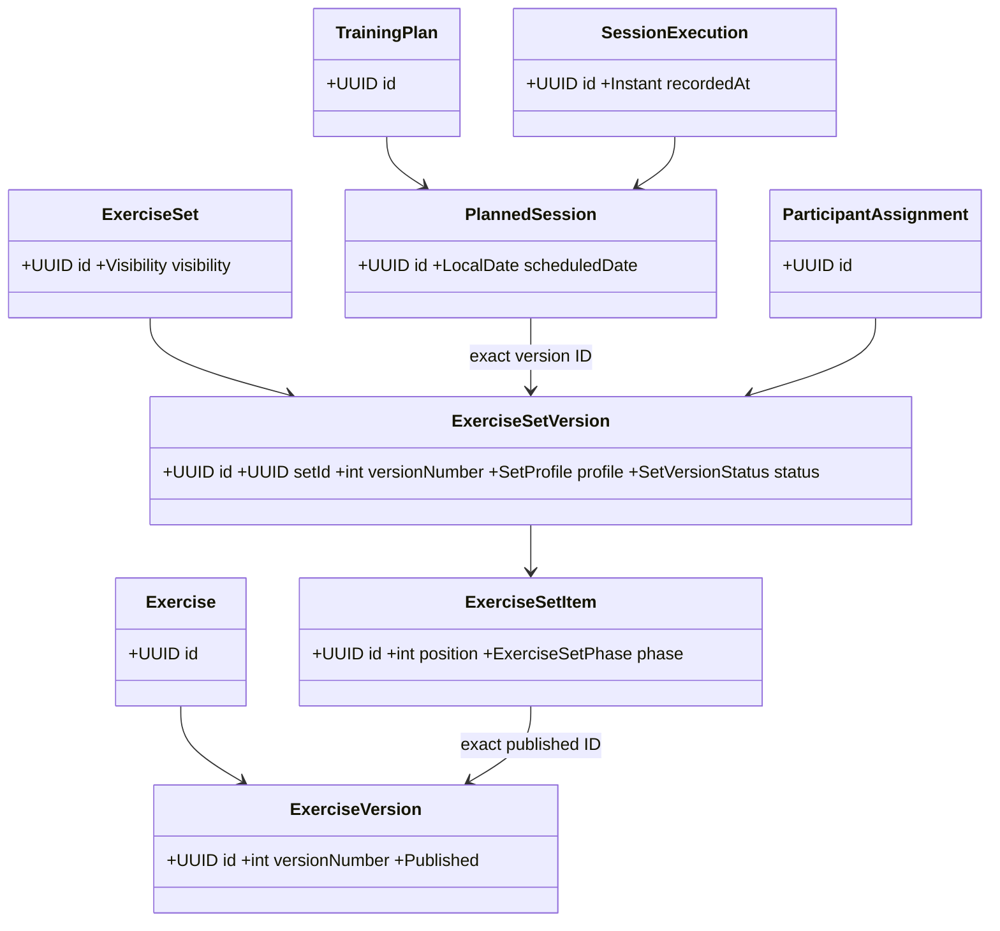
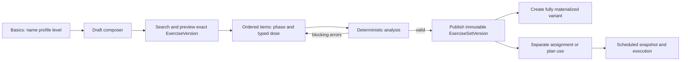

# Model zestawów ćwiczeń

**Status: SET-06A rozszerza wdrożoną ekspozycję o diagnostykę mapowania wizualnego; SET-02–SET-04 pozostają dostarczonym fundamentem.** Ten dokument pozostaje kanonicznym
kontraktem architektonicznym, ale od 2026-07-28 opisuje również rzeczywiście wdrożony
rdzeń backendowy. Implementacja znajduje się w `com.motionecosystem.exercisesets`; jej
stan i ograniczenia opisują [status](../status/current-state.md) oraz
[roadmapa](../roadmap/exercise-set-builder.md). Decyzję granic utrwala
[ADR-013](../adr/ADR-013-independent-versioned-exercise-sets.md).

## Zaimplementowany rdzeń SET-02 i wejście SET-03

Migracja [V038__create_exercise_sets.sql](../../src/main/resources/db/migration/V038__create_exercise_sets.sql)
tworzy niezależny schemat `exercise_set` i tabele `exercise_set`,
`exercise_set_version`, `exercise_set_item` oraz `exercise_set_item_dose`. Nie zawiera
on identyfikatora uczestnika, konta uczestnika, terminu, planowanej sesji ani danych
wykonania.

- Pakiet `com.motionecosystem.exercisesets` ma warstwy `domain`, `application`, `ports`,
  `infrastructure` i `api`. Publicznym portem aplikacyjnym jest
  `ExerciseSetCommandPort`, a adapterem `ExerciseSetApplicationService`.
- `ExerciseSetEntity` jest rootem tożsamości: UUID, `ownerAccountId`, widoczność
  `PRIVATE|SHARED|ORGANIZATION`, audyt i `@Version`. Obecne endpointy są jednak
  owner-scoped i obsługują wyłącznie zestawy własne; współdzielenie nie jest jeszcze
  przypadkiem użycia API.
- `ExerciseSetVersionEntity` ma rosnący numer unikalny w zestawie, lifecycle
  `DRAFT → PUBLISHED → RETIRED`, autora, metadane drafu i jedyne `@Version`; jego `lockVersion`
  jest tokenem współbieżności draftu. Każda udana mutacja dotyka `updatedAt` wersji i zwraca
  token dopiero po flushu; `ExerciseSet` nie jest
  współbieżnościowym tokenem tych operacji. Zmiana metadanych,
  pozycji i kolejności jest dozwolona tylko w `DRAFT`; publikacja oraz wycofanie nie
  usuwają historycznego odczytu. Kolejny draft i draft wariantu są pełnymi kopiami
  pozycji oraz dawek źródłowej opublikowanej wersji.
- `ExerciseSetItemEntity` zachowuje dokładny `exerciseVersionId`, fazę
  `PREPARATION|MAIN|ACCESSORY|COOLDOWN` i ciągłą kolejność `1..n`. Operacje add/update/
  move/remove renumerują pozycje w transakcji, a baza wymusza unikalność pozycji w wersji.
- Dodanie lub zamiana pozycji używa wyłącznie publicznego
  `ExerciseCatalogQueryPort.findPublishedVersion`. Zapisuje minimalny snapshot:
  `canonicalName`, numer wersji, `profileSchemaVersion`, wzorce ruchu i wymagany sprzęt.
  Snapshot stabilizuje historyczny odczyt, nie zastępuje referencji do wersji katalogu.
- `exercise_set_item_dose` jest hierarchią JPA `SINGLE_TABLE`. Wewnętrzna kolumna
  persistence ma nazwę `kind`, natomiast zewnętrzny dyskryminator DTO/OpenAPI ma nazwę
  `type`; jego wartości to `STRENGTH`, `ISOMETRIC`, `MOBILITY`, `STRETCH`, `BREATHING`,
  `AEROBIC`.
  Kontrole SQL oraz walidacja serwisu chronią obowiązkowy kształt i dodatnie zakresy;
  implementacja nie sprawdza jeszcze katalogowej capability dawki ani reguł fizjologicznych.
- Wariant `BASE` nie ma źródła; `SHORT` i `MINIMUM` tworzą pełny snapshot względem
  opublikowanej wersji tego samego zestawu. Publikacja weryfikuje źródło i wykrywa cykl.

Aktualne API zabezpieczone rolą `SPECIALIST` działa pod
`/api/v1/specialist/exercise-sets`: create/list/get, historia i odczyt wersji/draftu/
najnowszej publikacji, pełny `PUT` metadanych draftu, komendy pozycji, publikacja,
następny draft, draft wariantu i wycofanie. Odpowiedzi są DTO, nie encjami JPA; błędy
domenowe są `ProblemDetail` z `code` i — gdy dotyczy — `field`. `Dose` ma Jacksonowy
typ `type` i adnotację OpenAPI `oneOf`. Snapshot `web/openapi/openapi.json`, wygenerowany
klient TypeScript (w tym `ExerciseSetControllerApi` i modele dawek) oraz
`ApiFacade.exerciseSets` są zsynchronizowane z API przez standardowy przepływ
`api:refresh`/`api:verify`. Testy MockMvc/PostgreSQL/Testcontainers pokrywają pion
create/read/update/publish oraz utrwalenie typowanych dawek.

Skupione walidacje pionu SET-02 są zielone. Formalne kryterium pełnej walidacji etapu
pozostaje otwarte wyłącznie dlatego, że globalny `ModuleBoundaryTest` i pełne
`mvn verify` kończą się niezerowo na zastanym cyklu modułów oraz legacy fixtures po V036.
Nie wskazują one defektu ani zakazanej zależności `exercisesets`; pion jest gotowy jako
wejście do SET-03.

### Wybór katalogowy SET-03

SET-03 nie zmienia granicy agregatu zestawu. Katalog udostępnia odczytowe endpointy
`POST /api/v2/exercises/search` i `GET /api/v2/exercises/versions/{id}/preview`.
Pokazują one wyłącznie aktualne opublikowane wersje wybieralne dla nowego zestawu.
`ExerciseCatalogSearchService.selectable` jest minimalnym hand-offem katalogowym:
zwraca dokładny `exerciseVersionId` i snapshot kompatybilny z celem
`ExerciseCatalogQueryPort`. Reużywalny `ExercisePickerComponent` emituje mały
`ExerciseSelection`, ale nie zapisuje zestawu; SET-04 przełoży go na komendę dodania
pozycji do drafu. Szczegóły: [wyszukiwanie katalogu](exercise-catalog-search.md) oraz
[ADR-014](../adr/ADR-014-postgresql-catalog-search.md).

### Builder SET-04

Builder specjalisty jest dostępny pod `/exercise-sets`: lista, nowy draft, edycja draftu
i readonly opublikowanej wersji. Komponent picker pozostaje właścicielem wyszukiwania i
emituje dokładnie `ExerciseSelection`; builder wykorzystuje wyłącznie
`exerciseVersionId` w generowanym `ItemRequest`. Metadane drafu zapisują się po debounce,
a wszystkie komendy mutujące przenoszą `lockVersion`. Konflikt optimistic locking nie
nagradza cichym nadpisaniem: UI odświeża wersję albo odrzuca lokalną zmianę. Dawkowanie
jest budowane przez discriminated union `Dose.type`, a brak pola wymaganego przez wybrany
formularz blokuje dodanie pozycji; UI nie wymyśla wartości domyślnych.

Publish przekazuje `expectedVersion` w kontrakcie HTTP i wygenerowanym kliencie, tak samo
jak pozostałe mutacje drafu.

Następujące elementy tego dokumentu nadal są celem kolejnych etapów, a nie obecną
implementacją: rozszerzone profilowe reguły kompletności i analiza anatomii zestawu,
assignment, integracja z planowaniem i wykonaniem oraz migracja `/plan`. Wdrożony zakres
analizatora SET-05 opisuje [analiza Exercise Set](exercise-set-analysis.md).

## As-is: inwentaryzacja i problem

| Obszar | Model istniejący i odpowiedzialność | Właściciel | Problem | Możliwe wykorzystanie |
|---|---|---|---|---|
| Katalog | `Exercise`/wersjonowane `ExerciseVersion`, publikacja i podgląd treści ćwiczenia | `exercisecatalog` | nie ma zasobu zestawu | dokładna opublikowana wersja jest referencją pozycji zestawu |
| Import i akceptacja | import tworzy rekordy/drafty katalogu, review publikuje wersję; obecna implementacja importu używa `JdbcTemplate` | `exerciseimport` + `exercisecatalog` | import nie jest builderem zestawów; JDBC nie jest wzorcem dla nowej domeny | zaakceptowane wersje i metadane; SET-02 używa JPA/Hibernate |
| Plan | `TrainingPlan`, `PlanRevision`, `TrainingGoal`, `TrainingCycle`, `Microcycle` | `trainingplanning` | plan zawiera jednocześnie strukturę i osobę | zachować rewizje oraz kolejność cykli |
| Sesja/recepta | `PlannedSession` ma datę/okno; `ExercisePrescription` wskazuje wersję ćwiczenia, pozycję, płaskie serie/powtórzenia | `trainingplanning` | recepty są per sesja i nie są reużywalnym zestawem | legacy odczyt/mapping do pozycji zestawu |
| Wariant | V021: `planned_session_variant` i `planned_session_variant_item` (`STANDARD`/`SHORT`/`MINIMUM`) nadpisują płaskie pola recept pojedynczej sesji | `trainingplanning` | wariant jest sprzężony z `PlannedSession` i `ExercisePrescription`, nie wersją zestawu | zachować historycznie; nie utożsamiać z targetowym wariantem |
| Tożsamość uczestnika | V036: `participant.participant_record` i `participant_id` są kanoniczne; `participant_account_id` został nullable legacy bridge w planach, sesjach i wykonaniu | `participant` + właściciele tabel | wcześniejsze flow wiążą dane z kontem, a nie kartoteką | przyszłe `ParticipantAssignment` referencjonuje kanoniczny `participantId` |
| Wykonanie | `SessionExecution` i elementy wykonania zapisują wykonanie/historyczne obciążenie | `trainingexecution` | nie może stać się częścią definicji zestawu | append-only referencja do snapshotu przydziału/sesji |
| Bezpieczeństwo | oceny i ograniczenia zależą od uczestnika, relacji/capabilities i kontekstu | `safety` | bezpieczeństwo generyczne miesza się w formularzu planu | oddzielić ocenę przypisania i gotowość dnia |
| UI „Nowy plan” | route `/plan`, `PlanPage`; ładuje aktywnych uczestników i `/api/v1/exercises`, tworzy draft V2, cel, cykl, mikrocykl, sesję, `ExercisePrescription`, warianty i walidacje | Angular + `trainingplanning` | jeden formularz wiąże uczestnika, ćwiczenie, datę, dawkę i warianty | legacy do zastąpienia etapowo |

Aktualny endpoint katalogu to `GET /api/v1/exercises` (`ExerciseCatalogController`),
z paginacją offsetową oraz filtrami `query`, `movementPattern`, `technicalLevel`,
`equipment`. Admin/import/review są osobnymi endpointami. Testy `TrainingPlanningV2IntegrationTest`,
`PlanRevisionWorkflowIntegrationTest` i `TrainingPlanningExecutionIntegrationTest` chronią
obecny przepływ; nie są kontraktem targetowego zestawu. V004 i V009 ustanawiają legacy
planowania/recept, V014 wykonanie, V021 warianty per planned session/item, a V036
przenosi kanoniczną tożsamość do `participant_id` przy zachowaniu mostów konta.
V017 i kolejne rozbudowują katalog/import.

## Słownik i granice modułów

| Termin | Właściciel, ID, cykl życia i mutowalność | Zależności | Dane zakazane |
|---|---|---|---|
| **Exercise** | `exercisecatalog`; `ExerciseId` UUID; tożsamość ćwiczenia, żyje przez wersje; metadane identyfikacyjne kontrolowane przez katalog | ma `ExerciseVersion` | uczestnik, termin, wykonanie, dawkowanie zestawu |
| **ExerciseVersion** | `exercisecatalog`; UUID + numer wersji; draft/published/withdrawn; opublikowana niemutowalna | anatomia, sprzęt, aliasy, evidence | plan, data sesji, dane uczestnika |
| **ExerciseSet** | zaimplementowany `exercisesets`; UUID; trwała tożsamość, owner/autorstwo i visibility; nie jest nośnikiem treści publikowanej | ma wersje zestawu | uczestnik, data, wykonanie, ocena safety, pola planu |
| **ExerciseSetVersion** | zaimplementowany `exercisesets`; UUID, `setId`, rosnący `versionNumber`; `DRAFT → PUBLISHED → RETIRED`; published niemutowalna | pozycje, profil, minimalny snapshot katalogu | uczestnik, planowana data, wykonanie, indywidualna safety |
| **ExerciseSetItem** | zaimplementowana encja podrzędna wersji; UUID, ciągła unikalna pozycja; edytowalna tylko w drafcie | dokładny `ExerciseVersionId`, typowana dawka, faza | dane wykonania i osobiste ograniczenia |
| **ExerciseSetPhase** | VO/enum pozycji: `PREPARATION`, `MAIN`, `ACCESSORY`, `COOLDOWN` | profil zestawu nadaje semantykę | kliniczna ocena osoby |
| **Goal** | `trainingplanning`; UUID w rewizji planu; wersjonowany z rewizją i edytowalny wyłącznie przed jej zamknięciem | plan revision | nie jest globalnym celem zestawu ani diagnozą |
| **TrainingPlan** | `trainingplanning`; UUID i rewizje; struktura sekwencji użycia zestawów/sesji | plan revision, cycle/microcycle/planned session | definicja katalogowa zestawu, wykonanie |
| **PlannedSession** | `trainingplanning`; UUID; konkretna data/okno w rewizji; mutowalna zgodnie z rewizją | `ExerciseSetVersionId` **albo** legacy recepty podczas migracji | treść zestawu, historia wykonania |
| **ParticipantAssignment** | przyszły `assignment`; UUID; aktywne/zakończone/anulowane, z niezmiennym snapshotem kontekstu | participant + set version **lub** plan revision; overrides/restrictions | mutacja opublikowanego zestawu, zapis wykonania |
| **SessionExecution** | `trainingexecution`; UUID; append-only historyczny fakt | planned session i `AssignmentSnapshot`/exact version snapshot | edycja definicji zestawu lub planu |
| **Participant / Specialist** | `participant` / specialist profile; UUID, relacja i IANA timezone należą do ich modułów | są referencjami assignment/autorstwa | nie są częścią treści wersji zestawu |

Referencje przekraczają moduły wyłącznie UUID i porty; nie ma wspólnego agregatu
katalog–zestaw–plan–uczestnik–wykonanie. Wszystkie nowe utrwalenia użyją JPA/Hibernate,
nie `JdbcTemplate`.

## Model docelowy



### ExerciseSet aggregate

Root `ExerciseSet(UUID)`: author specialist reference, `PRIVATE|SHARED|ORGANIZATION`
i identity-level tagi. **Nie przechowuje profilu/type.** Read projection może wyprowadzić
profil z bieżącej opublikowanej wersji, lecz nie jest to pole autorytatywne ani stan root.
Commands: `CreateSet`, `ChangeVisibility`,
`CreateDraftVersion`, `RetireSet`. Queries: list/detail/version history. Events:
`ExerciseSetCreated`, `ExerciseSetVisibilityChanged`, `ExerciseSetRetired`. Invariants:
author may change visibility only under authorization; an identity has unique monotonically
numbered versions; retirement never mutates published content. Title, level, goals and
version notes are version snapshots, not mutable identity content.

### ExerciseSetVersion aggregate

Root `ExerciseSetVersion(UUID, setId, versionNumber)`: profile, title, target level,
goals, notes, ordered `ExerciseSetItem`, variant provenance, and immutable snapshots used
for display/analyser. Aktualny item zachowuje exact `ExerciseVersionId` **oraz** nazwę,
numer wersji, wersję schematu profilu, wzorce ruchu i wymagany sprzęt; nie zachowuje
jeszcze klasyfikacji, anatomii, difficulty ani body position. Niezmienna wersja katalogu
pozostaje źródłem prawdy. Estimated time i przejścia sprzętu są wyprowadzanymi metrykami
analizatora, nie deklaracją kliniczną.

Commands: `AddItem`, `ReplaceItem`, `MoveItem`, `ChangePhase`, `ChangeDose`,
`RemoveItem`, `CheckVersion`, `PublishVersion`, `RetireVersion`, `CreateVariantDraft`.
Queries: draft editor, published version, analysis. Events: `SetVersionDrafted`,
`SetItemAdded`, `SetVersionChecked`, `SetVersionPublished`, `SetVersionRetired`.
Target invariants: only drafts change; positions are positive and unique; every item points
to a published catalog version compatible with its dose; publication has no blocking
analysis results; version profile, set visibility and snapshot provenance are complete.
SET-02 enforces the draft/position/published-version/structural-metadata subset. SET-05
dodaje deterministyczne wyniki struktury/czasu/sprzętu i zapisuje snapshot wyniku przy
publikacji; capability dawki, anatomia i rozszerzone reguły profilowe pozostają odroczone.
Retiring blocks new use but never invalidates history.

### Item, value objects and commands

`ExerciseSetItem` contains `position`, phase, exact published exercise-version UUID,
`DoseSpecification`, optional display/anatomy snapshot and author note. Value objects:
`DoseSpecification`, `Duration`, `RestPeriod`, `Tempo`, `Load`, `IntensityTarget`,
`Side`, `EquipmentSet`, `SetGoals`, `AnalysisReference`. A `DoseSpecification` cannot be
empty, use an unsupported metric, contain negative quantities, or encode two sides
ambiguously. `ExerciseSetItem` has no participant override; such changes live in
`ParticipantAssignment` and resolve into an immutable `AssignmentSnapshot` before a
scheduled/execution context.

### Plan, assignment and execution

`TrainingPlan` remains the root that versions/revises a sequence of cycles and
microcycles. `PlannedSession` is a concrete element with date/window and references one
exact `ExerciseSetVersion` once target integration is enabled; legacy
`ExercisePrescription` remains allowed only during migration. `SessionVariant` is a
legacy per-session concept, not an `ExerciseSet` variant.

`ParticipantAssignment` is a distinct aggregate for participant + exact set version or
plan revision, individualized allowed overrides and restrictions, source/author/audit
history. Scheduling resolves it to an immutable `AssignmentSnapshot`; it never changes
the set version. `SessionExecution` is append-only and records what was actually done
against the scheduled/assignment exact snapshot, preserving replay after all later edits.

| Aggregate root | Entities / VO / cross-boundary references | Commands, queries, events | Invariants and versioning |
|---|---|---|---|
| `TrainingPlan` | revision, goal, cycle, microcycle, planned session; refs exact `ExerciseSetVersionId` | create/revise/schedule/replace set; plan editor/history; `PlanRevisionCreated`, `SessionScheduled` | changes create a revision; an active/history revision is not rewritten |
| `ParticipantAssignment` | participant ref, target set-version **or** plan-revision ref, allowed override/restriction, `AssignmentSnapshot` | assign/change/end; active assignments/history; `ParticipantAssigned`, `AssignmentSnapshotCreated` | exactly one target; override is authorized and snapshot-resolved before schedule/execution |
| `SessionExecution` | execution items, check-in/result, immutable scheduled/assignment snapshot refs | record/complete/report barrier; execution timeline; `ExecutionRecorded`, `ExecutionCompleted` | append-only; never points to a mutable draft or mutates source definitions |

## Dawkowanie: discriminated typed variants

Wybór: jawne warianty, nie jeden rekord z opcjonalnymi polami. W Java/JPA docelowo jest
to hierarchia encji `SINGLE_TABLE`, utrwalana w kolumnie `kind`, z constraints DB oraz
Bean Validation. OpenAPI ma `oneOf` z dyskryminatorem `type`; Angular ma discriminated
reactive form. To uniemożliwia np. RPE bez jednostki właściwej dla rodzaju, daje dokładne
raportowanie wykonania i rozszerza się bez semantycznych nulli.

| `type` | Wymagane pola | Dopuszczalne uzupełnienia |
|---|---|---|
| `STRENGTH` | sets, reps lub `repRange`, rest | tempo, load (kg/%/band), RPE lub RIR, side |
| `ISOMETRIC` | sets, holdSeconds, rest | intensity/RPE, side |
| `MOBILITY` | reps **lub** durationSeconds, range/ROM target | side, controlled tempo |
| `STRETCH` | holdSeconds, repetitions, side | perceived-intensity scale |
| `BREATHING` | durationSeconds **lub** cycles, rhythm | position/instruction reference |
| `AEROBIC` | durationSeconds | distance, intensity, zone or RPE |

Range validation requires positive counts/times, `min ≤ max`, valid enum units, one
chosen intensity representation where applicable, and a dose capability declared by
`ExerciseVersion`. No generic free-form fallback exists in SET-02; a future capability-
compatible typed variant requires a new discriminator/versioned schema. Existing flat
`ExercisePrescription` (sets/repetitions etc.) is legacy mapping input, not the target.

## Warianty i wersjonowanie

Every published base, short or minimum variant is a fully materialized immutable
`ExerciseSetVersion`, never a delta. `variantOfVersionId` identifies a published source
version of the same set and `VariantKind` is `BASE|SHORT|MINIMUM`; `ADAPTED` is reserved
for approved, author-controlled future use. SET-02 supports manual copy to a `SHORT` or
`MINIMUM` draft and validates source/cycle on publication; it does not yet record a
generator rule version or generate a reduction. Specialist publication is therefore the
approval step. Thus a replay does not need the source draft nor a generator. Easier/harder
variants of one exercise stay catalogue relations (`VARIANT_OF`, `PROGRESSION`,
`REGRESSION`) on `ExerciseVersion`, not set variants.

## Profiles and deterministic analyser

`SetProfile` is deliberate and governs completeness, rather than making the four phases
universal: `FULL_SELF_GUIDED`, `WARMUP_MODULE`, `MAIN_MODULE`, `ACCESSORY_MODULE`,
`COOLDOWN_MODULE`, `HOME`, `THERAPEUTIC`, `MOBILITY`, `STRETCHING`, `BREATHING`.

| Profile | Required / optional structure | Blocking / warning rules | Time |
|---|---|---|---|
| Full self-guided | preparation + main; accessory/cooldown optional | block missing preparation/main, item, profile/title or phase order; warn duplicates | deterministic estimate from typed doses |
| Warmup | preparation required | block missing preparation plus universal structural checks | deterministic estimate from typed doses |
| Main | main required | block missing main plus universal structural checks | deterministic estimate from typed doses |
| Accessory | accessory expected | warn phase mismatch; universal structural blocks remain | deterministic estimate from typed doses |
| Cooldown | cooldown expected | warn phase mismatch; universal structural blocks remain | deterministic estimate from typed doses |
| Home / therapeutic | no dodatkowej reguły fazowej w v1 | universal structural checks | deterministic estimate from typed doses |
| Mobility / stretching / breathing | no dodatkowej reguły fazowej w v1 | universal structural checks | deterministic estimate from typed doses |

Wdrożony deterministyczny analizator przyjmuje wersję, pozycje, typowane dawki, fazy,
snapshot pozycji i profil. Zwraca `metrics`, findings `SUGGESTION`, `WARNING` i
`BLOCKING`; finding zawiera kod, wersję reguły, severity, kategorię, komunikat,
uzasadnienie oraz identyfikatory pozycji. Metryki obejmują czas, liczbę pozycji, przejścia
sprzętu i rodzajów dawek oraz jawną niedostępność anatomii. Reguły wykrywają brakujące
dane strukturalne, powtórzenia i nieprawidłową kolejność faz. Nie ma decyzji ML. Są to
wyjaśnialne sygnały strukturalne, nie porada kliniczna ani dokładne obciążenie biomechaniczne.

## Anatomia: available evidence and limits

| Need | Available now | Quality | Gap / required change |
|---|---|---|---|
| Muscle/region exposure | `exercise_contribution` roles, coefficient low/high/band; anatomy taxonomy | qualitative, provenance/evidence linked | coverage incomplete; do not sum into force |
| Supporting/stabilizing roles | contribution role is represented | uneven catalogue coverage | explicit confidence/completeness reporting |
| Joints/tendons | taxonomy includes structure types and starter tendon groups | reference exists, exercise linkage/filter exposure incomplete | typed exercise links and public facets before claims |
| Movement/contraction/plane | movement patterns and load characteristics | useful classification | not a mechanical joint-load model |
| ROM, position, unilateral, equipment | movement characteristics, equipment, side-related metadata | present variably | completeness and normalized query facets |
| Evidence/provenance | evidence links and import provenance | attached where curated | no universal evidence coverage |

Aktualny SET-05 nie ma jeszcze w snapshocie danych anatomii, klasyfikacji, difficulty ani
body position i zawsze jawnie zgłasza ich niedostępność. SET-06 może dostarczyć wyłącznie
jakościową ekspozycję muscle/region, joint/tendon i movement-pattern z provenance oraz
etykietą braków danych; nie może przedstawiać jej jako precyzyjnej siły, obciążenia
więzadła/ścięgna ani medycznej oceny przydatności. Structural coverage, sequence and
volume concentration are separate metrics.

## Future catalog search contract (not implemented)

`GET /api/v2/exercise-search?query=przysiad&locale=pl-PL&status=PUBLISHED&movementPattern=SQUAT&bodyRegion=LOWER_LIMB&equipment=BARBELL&cursor=...&size=20&sort=RELEVANCE_NAME_VERSION_ID`

```json
{
  "items": [{
    "exerciseVersionId": "1db3b55e-51e8-4e94-8c8f-e19ad1edb1a1",
    "exerciseId": "887ae1bd-3ba3-48d4-a859-bd6d3c9ac0c6",
    "versionNumber": 3,
    "name": "Przysiad ze sztangą", "aliases": ["back squat"],
    "status": "PUBLISHED", "movementPatterns": ["SQUAT"],
    "equipment": ["BARBELL"], "doseCapabilities": ["STRENGTH"],
    "preview": {"technicalLevel": "INTERMEDIATE", "anatomyCompleteness": "PARTIAL"}
  }],
  "facets": {"movementPattern": [{"value": "SQUAT", "count": 14}]},
  "nextCursor": "opaque-cursor", "sort": "RELEVANCE_NAME_VERSION_ID"
}
```

The target supports normalized Polish diacritics and aliases, text name/description
matching, filters for category/type, region, muscle, joint, tendon, pattern, equipment,
position, level, unilateral, purpose/therapeutic use and status; stable relevance/name/
version-ID order; cursor pagination; facet counts; preview/detail without leaving the
builder; and exact `ExerciseVersion` selection. Query projections must avoid N+1.
Current `/api/v1/exercises` has only the smaller filter surface above and offset pages.

## UX target

Desktop composer: **catalog/search+filters** | **ordered set content** | **analysis**.
Search preserves filters and offers an accessible preview; add uses exact published version.
Items can be reordered, phase/dose edited, swapped or removed. Draft autosave visibly
reports state and uses optimistic conflict handling. Analysis explains time, completeness,
anatomy/pattern coverage, equipment and every finding. Actions are `Zapisz draft`,
`Sprawdź`, `Opublikuj`, `Utwórz wariant`, `Przypisz`; assigning happens after publication,
not in creation. On narrow screens panels become ordered sections, buttons remain keyboard
reachable and focus moves to validation summaries.



## Three safety levels

1. **Set integrity** belongs to `exercisesets`: deterministic completeness and valid
   catalogue/dose only; it may block publication but cannot evaluate a person.
2. **Assignment safety** belongs to `safety` plus `assignment`: participant restrictions,
   consent, specialist authority and override rationale; it may block or require explicit
   resolution. Generic creation must not access personal health/safety facts.
3. **Day execution readiness** belongs to `safety`/`trainingexecution`: current check-in,
   pain, contraindications and scheduled context; it may block/postpone that execution, never
   rewrite the published set or silently move sessions.

## Incremental migration (no big bang)

1. Add JPA/Hibernate `exercisesets` schema and read/write ports beside legacy; future
   Flyway migrations only, no edits to V004/V009/V014/V017.
2. Release builder for drafts/published sets while `/plan` remains unchanged.
3. Let new `PlannedSession` reference exact set version, retaining legacy prescriptions.
4. Move active creation flows to choose/publish then plan/assign; map only compatible flat
   legacy doses to typed variants and flag ambiguous records.
5. Retire the New Plan creation UI/endpoints from new navigation after parity; retain
   legacy read views.
6. Keep historic plans, `ExercisePrescription`, `SessionVariant` and executions frozen;
   show their legacy provenance rather than inventing target versions.
7. After retention, exports and all read dependencies are migrated, remove legacy writes
   and then legacy tables/contracts in a separately approved release.

Risks: historical records can lack a compatible typed dose or immutable catalog snapshot;
participant/account bridges need mapping to `participantId`; current import uses JDBC;
OpenAPI client regeneration needs the normal snapshot workflow. Each future Flyway step
needs data backfill, idempotence, FK/index strategy and rollback/read compatibility tests.
